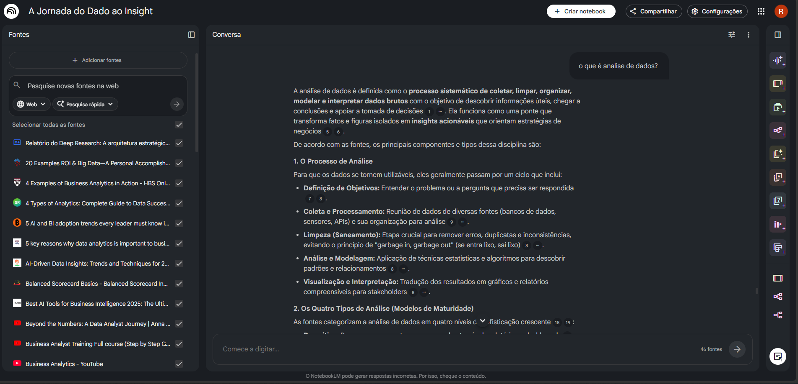
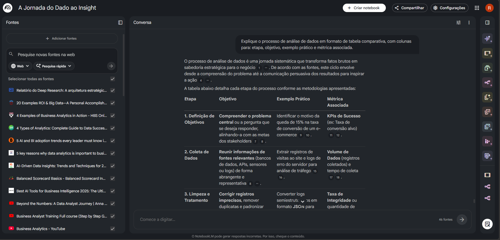

# 📊 A Jornada do Dado ao Insight  
### Estratégia, Storytelling e Sabedoria para Decisões de Negócio  

> Dado sem contexto é ruído. Contexto sem ação é desperdício.

## 📌 Contexto
O notebook “A Jornada do Dado ao Insight: Estratégia, Storytelling e Sabedoria para Decisões de Negócio” foi pensado com base na necessidade de transformar dados em suporte efetivo para a tomada de decisão. Em qualquer contexto de decisão, os dados são parte fundamental no processo, nesse sentido, para além de análisa-los é essencial compreender todo o processo, desde a coleta até a interpretação e aplicação estratégica.

O material aborda a análise de dados como um fluxo integrado, no qual técnica, contexto e comunicação se combinam para gerar valor. Assim, o analista é incluido como um agente estratégico, capaz de transformar dados brutos em insights que orientam decisões mais assertivas e alinhadas aos objetivos do negócio.

## 🎯 Objetivos
- Compreender o processo completo de análise de dados, da coleta à geração de insights para decisão;
- Diferenciar os tipos de análise (descritiva, diagnóstica, preditiva e prescritiva) no contexto decisório;
- Desenvolver a capacidade de comunicar insights por meio de data storytelling;
- Relacionar métricas e indicadores com os objetivos estratégicos do negócio;
- Utilizar dados operacionais como apoio à análise e monitoramento;

## 📚 Curadoria de Fontes
- https://www.kufunda.net/publicdocs/Storytelling%20com%20Dados%20(Cole%20Nussbaumer%20Knaflic%20[Knaflic%20etc.).pdf
- https://www.geeksforgeeks.org/data-analysis/six-steps-of-data-analysis-process/
- https://barc.com/data-culture/
- https://studyonline.unsw.edu.au/blog/descriptive-predictive-prescriptive-analytics
- https://www.ontotext.com/knowledgehub/fundamentals/dikw-pyramid/

## 🧠 Engenharia de Prompts e “Cicatrizes” do Processo
No decorrer da criação deste material, a elaboração das instruções passou por 
várias revisões até gerar respostas mais pertinentes e detalhadas.

A primeira descoberta importante foi que, devido ao volume e à qualidade das fontes carregadas no NotebookLM, mesmo prompts simples e diretos retornavam respostas bem estruturadas e tecnicamente ricas — desde que o tema estivesse coberto pelas fontes. Isso revelou um comportamento relevante da ferramenta: a qualidade das fontes cria um "teto alto" para qualquer resposta, mas também padroniza o formato de saída, geralmente em listas numeradas com subtítulos.

Esse padrão único, embora completo, pode dificultar o aprendizado dependendo do perfil do leitor. Para quem aprende melhor com exemplos práticos comparativos, uma lista genérica tem menos valor do que uma tabela estruturada. Nesse sentido, a engenharia de prompts deixou de ser apenas uma ferramenta para melhorar a qualidade do conteúdo e passou a ser um recurso para adaptar o formato da entrega ao estilo de aprendizagem desejado.

Teste 1 — Mudança de profundidade

**Prompt inicial:**
> "O que é análise de dados?"

**Resposta obtida:**

A resposta retornou um conteúdo completo, com processo de análise, os quatro tipos (descritiva, diagnóstica, preditiva e prescritiva) e a pirâmide DIKW — tudo bem organizado em listas. Tecnicamente correta, mas no mesmo padrão visual de qualquer outra resposta da ferramenta.

Teste 2 — Mudança de formato

**Prompt refinado:**
> "Explique o processo de análise de dados em formato de tabela comparativa, 
> com colunas para: etapa, objetivo, exemplo prático e métrica associada."

**Resposta obtida:**

O mesmo conteúdo foi reestruturado em uma tabela com seis etapas detalhadas, cada uma com objetivo, exemplo prático e métrica associada. A informação não mudou — o que mudou foi a forma de acessá-la, tornando a comparação entre etapas muito mais direta e útil para revisão.

Aprendizado consolidado
A principal lição deste processo não foi que prompts elaborados geram respostas melhores — as fontes ricas já garantiam isso. O aprendizado real foi que **o prompt controla o formato da entrega**, e o formato impacta diretamente a experiência de aprendizado. Ao especificar a estrutura esperada (tabela, narrativa, lista comparativa), é possível transformar o mesmo conteúdo em diferentes ferramentas de estudo.

Criar prompts eficazes exige, portanto, uma reflexão sobre três perguntas:
- O que eu quero aprender?
- Como eu aprendo melhor?
- Qual formato de resposta serve melhor a esse objetivo?

## 🚀 Jornada do Dado ao Insight (Entrega Final)
1. Resumo Estruturado
A análise de dados para tomada de decisão envolve um processo integrado que vai da coleta até a comunicação dos insights. Inicialmente, os dados são coletados e tratados, passando por etapas de limpeza e estruturação para garantir qualidade.Na sequência, são aplicadas diferentes abordagens analíticas:
Descritiva: entende o que aconteceu
Diagnóstica: explica por que aconteceu
Preditiva: estima o que pode acontecer
Prescritiva: sugere ações
Além disso, a transformação de dados em valor segue a lógica da pirâmide DIKW (Dados → Informação → Conhecimento → Sabedoria), onde o dado bruto ganha contexto e utilidade. Por fim, a comunicação dos resultados por meio de data storytelling e dashboards permite que os insights sejam compreendidos e utilizados na tomada de decisão estratégica.

2. Glossário
Dado: registro bruto sem contexto
Informação: dado organizado e contextualizado
Conhecimento: interpretação dos dados
Sabedoria: aplicação do conhecimento na decisão
Análise Descritiva: análise do passado
Análise Diagnóstica: identificação de causas
Análise Preditiva: projeção de cenários
Análise Prescritiva: recomendação de ações
Data Storytelling: comunicação de dados com narrativa
KPI: indicador de desempenho
Parsing: transformação de dados brutos em estruturados

3. Prompts Reutilizáveis
“Explique [conceito] de forma aplicada ao contexto de negócio, com exemplos práticos.”
“Compare [conceito A] e [conceito B] destacando aplicações na análise de dados.”
“Descreva o processo completo de [tema] incluindo etapas, ferramentas e métricas.”
“Transforme essa explicação técnica em uma narrativa voltada para tomada de decisão.”
“Quais métricas podem ser utilizadas para avaliar [processo/sistema]?”
“Explique [conceito] considerando impacto no negócio, possíveis métricas e como esse insight poderia apoiar a tomada de decisão.”

Como complemento, este material também foi construído com base em uma perspectiva prática, considerando a utilização de dados operacionais (como logs) no apoio à tomada de decisão, aproximando o conteúdo teórico da realidade de ambientes corporativos.
